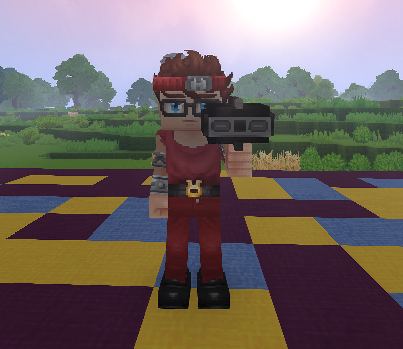
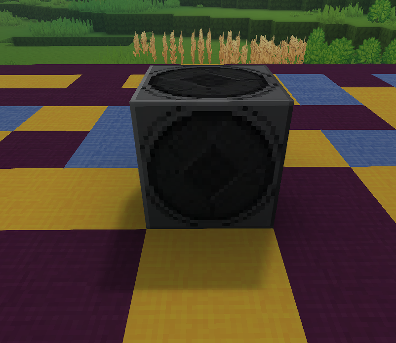

# MediaRadio-Hytale
MediaRadio is a Hytale mod that lets players stream web audio through a Portable Radio (handheld)
or a placeable Boombox. Music only plays while the Portable Radio is held (main hand or offhand),
or while a Boombox is placed, and the UI provides a media-player style interface with
play/pause/stop, seek, looping, and a per-player library.

## Features
- Plays web audio from supported URLs (YouTube, etc.) using embedded yt-dlp + ffmpeg.
- Audio is downloaded, converted to OGG, and chunked for streaming (with reduced streaming lag).
- Portable Radio (handheld) and Boombox (placeable) items.
- Per-player libraries: each player only sees the songs they requested.
- Thumbnails are downloaded and registered as dynamic assets.
- Playback pauses automatically when the Portable Radio is not held.
- Portable Radio includes a proper model and animation set.

## Notes
- Embedded tools live in the `media-tools` subproject and are loaded from the classpath.
- If you ship separate jars, include the MediaRadio jar and the `media-tools` jar together.
- This mod uses runtime asset packs under `run/media_radio_assets`.
- For now, client-hosted/singleplayer worlds are not supported; the mod needs a dedicated server environment and access to external tools (sandboxing prevents this). Future support is planned.

## Recipe
- Crafted at a Furniture Bench (Furniture Misc).
- Portable Radio and Boombox both cost 15 Iron Bars, 25 Copper Bars, and 5 Rubble.

## Screenshots

## Setup (Prebuilt)
1. Download the latest MediaRadio mod binaries.
2. Copy the mod binary (and the `media-tools` binary if shipped separately) into your Hytale server `mods` folder.
3. Start the server and join a world.
4. Give yourself the Portable Radio or Boombox and open the UI to start playback.

## Build (From Source)
1. Add platform binaries to `media-tools/src/main/resources/tools/<os>/<arch>/`:
   - `<os>`: `windows`, `macos`, `linux`
   - `<arch>`: `x86_64`, `arm64`
   - Example: `media-tools/src/main/resources/tools/linux/x86_64/yt-dlp_linux`
   - ffmpeg bundles should include full archive contents, e.g. `media-tools/src/main/resources/tools/windows/x86_64/ffmpeg/bin/ffmpeg.exe` (Windows) or `.../ffmpeg/ffmpeg` (macOS/Linux)
2. (Optional) Download the latest binaries automatically:
   - `./gradlew downloadEmbeddedTools`
3. Build the mod:
   - `./gradlew build`
4. Find the built mod binaries in `build/` and `media-tools/build/`.
5. Copy the built mod binaries into your Hytale server `mods` folder.
6. Start the server and join a world.
7. Give yourself the Portable Radio or Boombox and open the UI to start playback.
