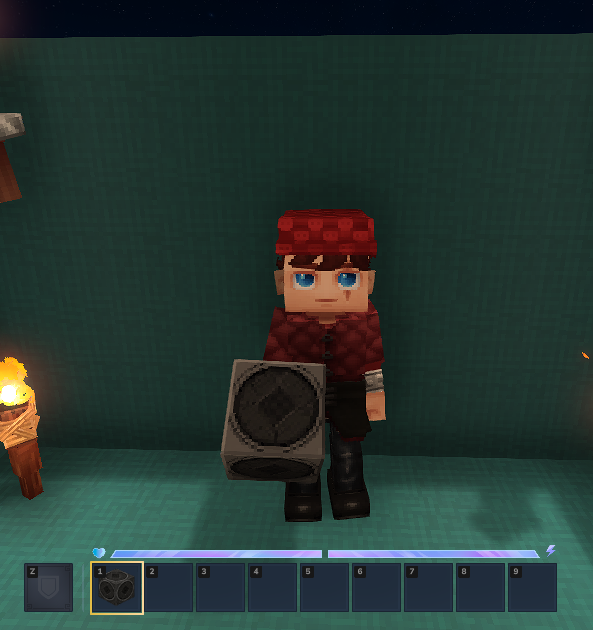
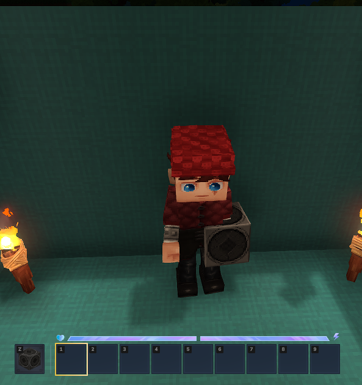
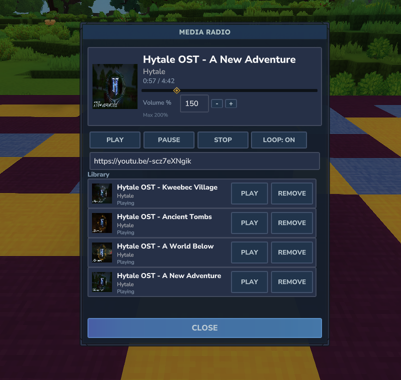

# MediaRadio-Hytale
MediaRadio is a Hytale mod that lets players stream web audio through a handheld radio item.
Music only plays while the radio is held (main hand or offhand), and the UI provides a media‑player
style interface with play/pause/stop, seek, looping, and a per‑player library.

## Features
- Plays web audio from supported URLs (YouTube, etc.) using yt-dlp + ffmpeg.
- Audio is downloaded, converted to OGG, and chunked for streaming.
- Per‑player libraries: each player only sees the songs they requested.
- Thumbnails are downloaded and registered as dynamic assets.
- Playback pauses automatically when the radio is not held.

## Notes
- Requires `yt-dlp` and `ffmpeg` available on the server PATH.
- This mod uses runtime asset packs under `run/media_radio_assets`.
- For now, client-hosted/singleplayer worlds are not supported; the mod needs a dedicated server environment and access to external tools (sandboxing prevents this). Future support is planned.

## Recipe
- Crafted at a Furniture Bench (Furniture Misc).
- Costs 15 Iron Bars, 25 Copper Bars, and 5 Rubble.

## Screenshots

## Setup (Prebuilt)
1. Install dependencies:
   - `yt-dlp`
   - `ffmpeg`
2. Download the latest prebuilt MediaRadio mod binary.
3. Copy the mod binary into your Hytale server `mods` folder.
4. Start the server and join a world.
5. Give yourself the radio item and open the UI to start playback.

## Build (From Source)
1. Install dependencies:
   - `yt-dlp`
   - `ffmpeg`
   - JDK (compatible with your Hytale server environment)
2. Build the mod:
   - `./gradlew build`
3. Find the built mod binary in the Gradle output (`build/`).
4. Copy the built mod into your Hytale server `mods` folder.
5. Start the server and join a world.
6. Give yourself the radio item and open the UI to start playback.
